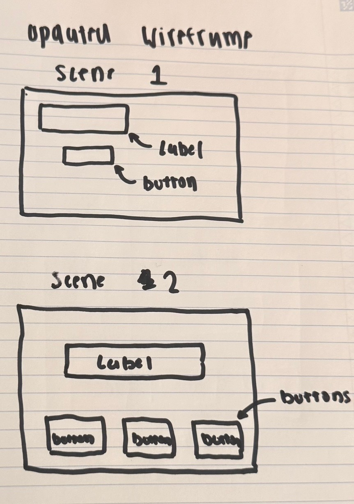

# My S2000 Quiz App!

Hello Class! This project is a small quiz app about my car, a Honda S2000. It contains 5 very short and simple questions, each with multiple-choice answers. The app keeps track of how many questions the user answers correctly and displays the final score/results at the end. Users interact with the quiz through buttons, and the questions and results are shown on the screen using the JavaFX labels. Additionally, I include pictures of my car in the background!
The inspiration for the project was that I wanted to make a very short and simple quiz app, that has a welcome scene, followed by an additional scene that displays a question along with answers. I initially was going to do a math game that displayed math questions, but Professor Soto inspired me to make it about something I like, so I made it about my car!

# How to Play !
- First load the game!
- Click on start the Quiz
- read the questions, then answer the questions!
- After all the questions have been answered, youll get your result!

# Wireframe for S2000 Quiz:

# UML Diagrams for S2000 Quiz:
This one is for the Class HelloController(Essentially the controller for Scene 2):

This one is for the Class Scene1Controller:
