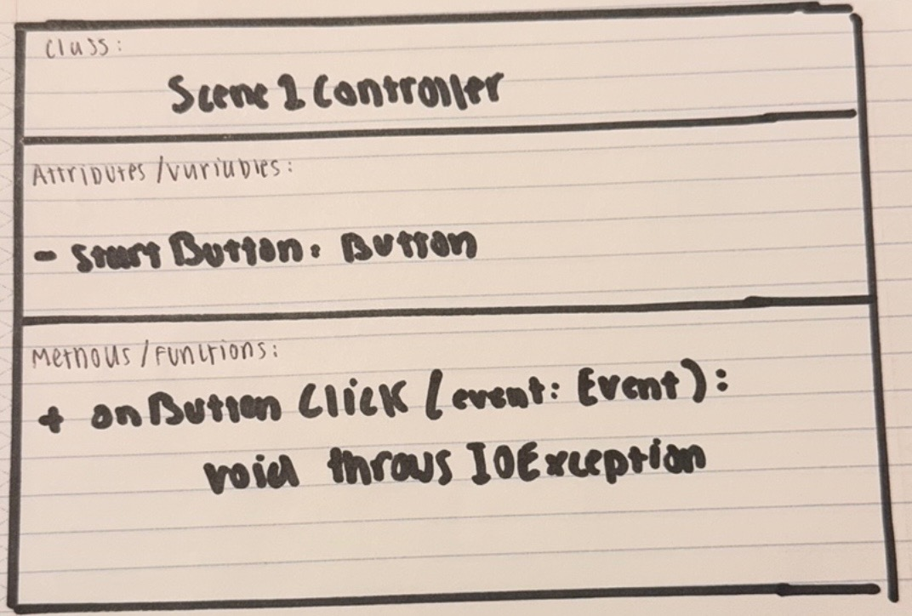

# My S2000 Quiz App!

Hello Class! This project is a small quiz app about my car, a Honda S2000! It contains 5 very short and simple questions, each with multiple-choice answers. The app keeps track of how many questions the user answers correctly and displays the final score/results at the end. Users interact with the quiz through buttons, and the questions and results are shown on the screen using the JavaFX labels assembled by SceneBuilder. Additionally, I include pictures of my car in the background!
The inspiration for the project was that I wanted to make a very short and simple quiz app, that has a welcome scene, followed by an additional scene that displays a question along with answers. I initially was going to do a math game that displayed math questions, but Professor Soto inspired me to make it about something I like, so I made it about my car!

# How to Play !
- First load the game!
- Click on start the Quiz
- read the questions, then answer the questions!
- After all the questions have been answered, youll get your result!

# Wireframe for S2000 Quiz:

# UML Diagrams for S2000 Quiz:
This one is for the Class HelloController(Essentially the controller for Scene 2):

This one is for the Class Scene1Controller:

Relationships/ notes:
- HelloController uses Button and Label objects (button 1,2,3 & label for prompt)
It controls the text and reads user clicks
- HelloController uses the Event object in the methods (onButtonClick and onHelloButtonClick)
to detect what the user clicks.
- HelloController uses Stage, Scene, and FXML loader to load a new file and to move to another screen when user clicks button
- Button and Label indirectly inherit from Node, which allow them to use shared methods as settext() and setDisable().
- Scene1Controller uses Button, it uses the loaded button from the FXML file to start the quiz.
- Scene1Controller uses Event, it calls event.getSource() to find the window or stage to update
- Scene1Controller uses FXMLLoader and Scene to load a new screen.

# Requirements:
Concrete Classes:
- Both HelloController and Scene1Controller are concrete classes. These are complete classes and can be used by JavaFX. They control how the quiz and the app’s screens work.

Abstract Classes or Interfaces:
- The project does not use any abstract classes or interfaces because it is small quiz app and everything is fully handled and mutated within the controllers. The quiz and screens are simple, so there is no need for extra general or abstract parts.

Inheritance/Polymorphism:
- Inheritance is partially used in my project as the controls such as Button and Label come from the node class
which gives them shared features. Events also use polymorphism or have polymorphic behavior, since
onButtonClick(Event event) can work with any kind of Event. My project uses the built-in javaFX behavior without creating or making new Parent classes and having "custom" inheritance.

Exception Handling: 
- Exception handling is included in the project using throws IOException in onHelloButtonClick and Scene1Controller.onButtonClick. This handles the possible errors when loading FXML files.

# Video on S2000 Quiz:
